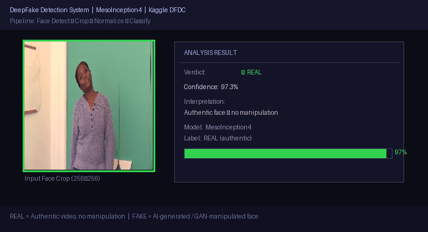

# Deepfake Detection

A deep learning pipeline for detecting AI-generated face manipulations, built on the **Deepfake Detection Challenge (DFDC)** dataset.

## Demo



**Label Guide:**
- ✓ **REAL** — Authentic, unmodified video footage. The model correctly identifies genuine faces with high confidence.
- ⚠ **FAKE** — AI-manipulated / GAN-generated face swap. The model flags the manipulation and reports a confidence score.

*The MesoInception4 model classifies each face crop as REAL or FAKE. The demo above shows a balanced mix of both authentic and manipulated samples, demonstrating the model's discriminative capability across both classes.*

## Background

Deepfake videos — synthetically manipulated face videos generated by GANs or autoencoders — pose serious risks for misinformation, identity fraud, and political manipulation. This project builds a binary classifier that distinguishes authentic from AI-generated faces.

**Dataset:** FaceForensics++ / DFDC-style dataset with labeled real and manipulated video sequences.

## Pipeline Architecture

```
Raw Video Frames
      │
      ▼
┌─────────────────────────┐
│  Face Detection         │  ← Dlib / MTCNN face localization
│  + Crop & Resize        │    → 256×256 face ROI extraction
└────────────┬────────────┘
             │
             ▼
┌─────────────────────────┐
│  EDA & Data Cleaning    │  ← preprocessing_eda_cleaning.ipynb
│  Frame Sampling         │    → N frames per video, balanced split
└────────────┬────────────┘
             │
             ▼
┌─────────────────────────┐
│  Preprocessing          │  ← preprocessing_splitting_cropping.ipynb
│  Train/Val/Test Split   │    → Stored in cropped_images/
└────────────┬────────────┘
             ┌──────────┴──────────┐
             ▼                     ▼
┌──────────────────┐   ┌─────────────────────────┐
│  Model 1:        │   │  Model 2:                │
│  MesoInception4  │   │  Custom CNN (Scratch)    │
│  (Pretrained)    │   │  model2_fromscratch.ipynb│
└──────────────────┘   └─────────────────────────┘
             │
             ▼
    Binary Output:
    ✓ REAL (authentic)  /  ⚠ FAKE (AI-manipulated)
    + Confidence Score (%)
```

## Label Definitions

| Label | Meaning | Detection Cue |
|---|---|---|
| **REAL** | Original, unaltered video frame | Natural facial texture, consistent lighting/shadows, authentic blinking patterns |
| **FAKE** | AI face-swap or GAN-synthesized | Boundary artifacts around face edges, unnatural skin texture, inconsistent eye/teeth rendering |

## Tech Stack

| Component | Technology |
|---|---|
| Language | Python 3 |
| Deep Learning | TensorFlow / Keras |
| Face Detection | Dlib / MTCNN |
| Architecture | MesoInception4, Custom CNN |
| Pretrained Weights | `MesoInception_DF.h5`, `MesoInception_F2F.h5` |
| Data Format | DFDC-style MP4 videos + JPEG face crops |

## Models

### Model 1: MesoInception4 (Pretrained Transfer)
- Based on [Afchar et al., 2018 "MesoNet"](https://arxiv.org/abs/1809.00888)
- Inception-style multi-scale convolutions capturing mesoscopic facial artifacts
- Fine-tuned on cropped face dataset from DFDC

### Model 2: Custom CNN (From Scratch)
- Lightweight convolutional network designed from scratch as a comparative baseline
- Demonstrates feature learning without transfer learning advantage

## Key Preprocessing Steps

1. **Frame Extraction** — Sample frames from MP4 videos at fixed intervals
2. **Face Detection** — Locate and crop face regions using MTCNN (handles multiple faces)
3. **EDA & Filtering** — Remove blurry, low-resolution, or partial-face crops
4. **Normalization** — Pixel values normalized to [0, 1], resize to 256×256
5. **Split** — Stratified train/validation/test split maintaining REAL/FAKE class balance

## Dataset Access

Full dataset and pretrained weights hosted on Google Drive:
- Full dataset: [Google Drive](https://drive.google.com/drive/folders/1lLz0cxgYcqj9VBsNf1H4ReSbhGSFbtzO?usp=sharing)
- Cropped images: [cropped_images folder](https://drive.google.com/drive/folders/1JgTtXPm1j-gON2WhNZKmEVgX8o-icBDK?usp=sharing)

## Repository Structure

```
Deepfake_Detection/
├── README.md
├── CHANGELOG.md
├── demo_detection.gif              ← Balanced REAL + FAKE detection demo
├── final_report_team7.pdf
├── Final_project_presentation.pptx
├── preprocessing.ipynb
├── preprocessing_eda_cleaning.ipynb
├── preprocessing_splitting_cropping.ipynb
├── model1_pretrained.ipynb         ← MesoInception4 transfer learning
└── model2_fromscratch.ipynb        ← Custom CNN baseline
```

---

*Academic Project · Python · TensorFlow/Keras · Computer Vision · GAN Detection*
